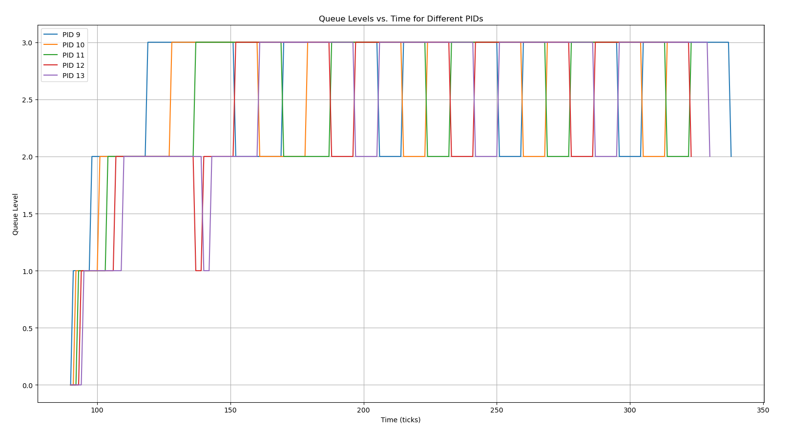
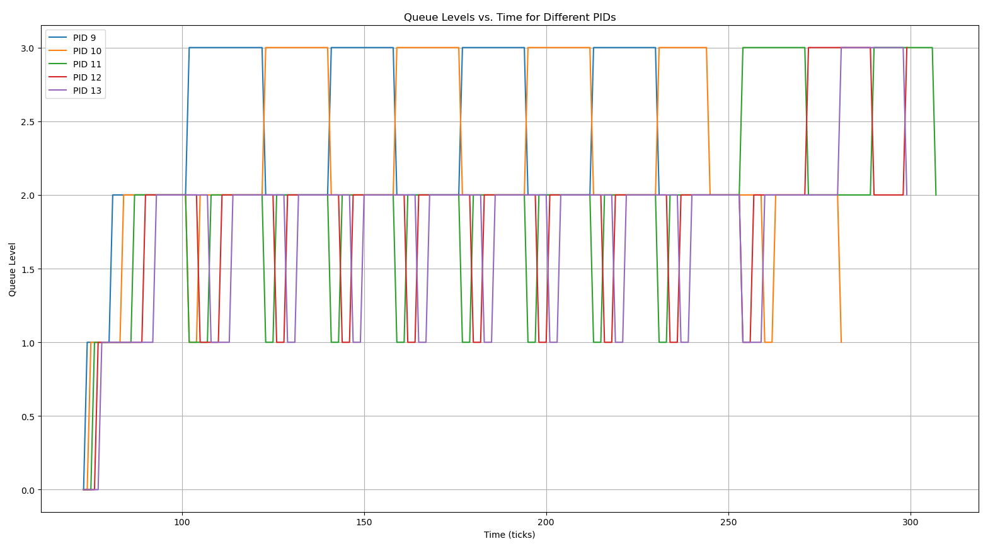
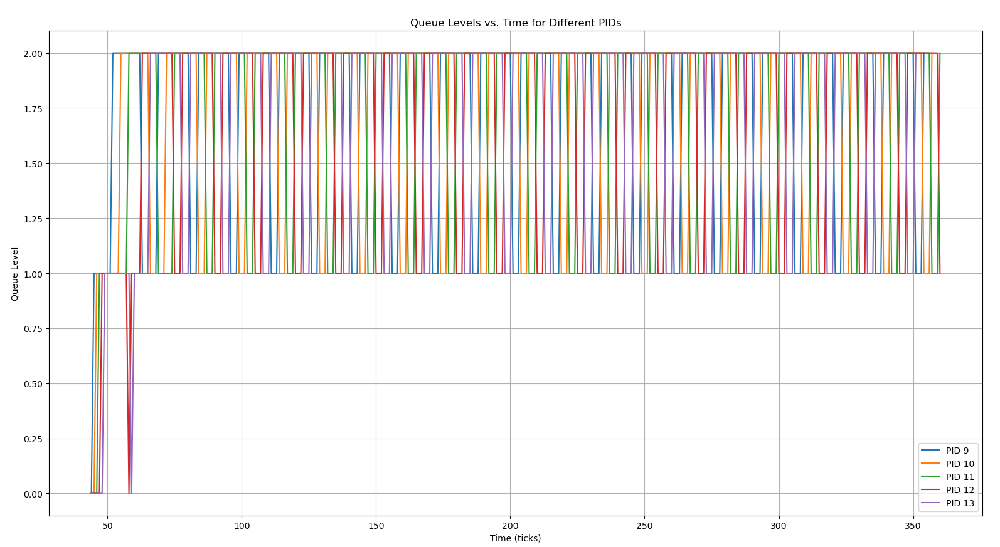
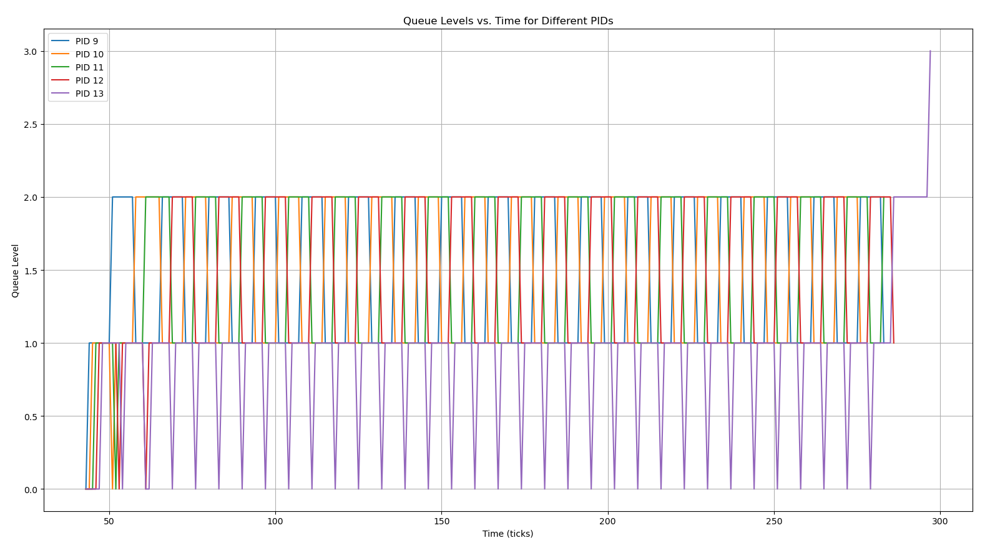

# Testing system calls

## Running Tests for getreadcount

Running tests for this syscall is easy. Just do the following from
inside the `initial-xv6` directory:

```sh
prompt> ./test-getreadcounts.sh
```

If you implemented things correctly, you should get some notification
that the tests passed. If not ...

The tests assume that xv6 source code is found in the `src/` subdirectory.
If it's not there, the script will complain.

The test script does a one-time clean build of your xv6 source code
using a newly generated makefile called `Makefile.test`. You can use
this when debugging (assuming you ever make mistakes, that is), e.g.:

```sh
prompt> cd src/
prompt> make -f Makefile.test qemu-nox
```

You can suppress the repeated building of xv6 in the tests with the
`-s` flag. This should make repeated testing faster:

```sh
prompt> ./test-getreadcounts.sh -s
```

---

## Running Tests for sigalarm and sigreturn

**After implementing both sigalarm and sigreturn**, do the following:
- Make the entry for `alarmtest` in `src/Makefile` inside `UPROGS`
- Run the command inside xv6:
    ```sh
    prompt> alarmtest
    ```

---

## Getting runtimes and waittimes for your schedulers
- Run the following command in xv6:
    ```sh
    prompt> schedulertest
    ```  
---

## Running tests for entire xv6 OS
- Run the following command in xv6:
    ```sh
    prompt> usertests
    ```

---

# Specification 3 : Report

## Implementation Details

### **FCFS**

The main idea in the FCFS scheduler is that the process that was created first should be run with priority.

The file `proc.h` already had the variable `ctime` defined for a process, which stores the creation time. Using that we can compare which process was created first.

We find the minimum `ctime` out of all the processes that are `RUNNABLE` and then choose and run that process by setting its state to `RUNNING`
Also, we use locks to ensure that the other CPUs don't choose the same process to run.

We ensure that the trap handlers do not `yield` in this case.

### **MLFQ**

The MLFQ scheduler was implemented using the queue data structure. We maintain queues for each priority level and a process is added to the queue corresponding to its priority level.

We have defined functions `init_queues`, `enqueue` and `dequeue` to handle initialization, enqueueing and dequeueing of processes from the queues.

Each process stores information like `entry_time`, `available_time` and `current_queue` which represent the time when a process was added to a particular queue, the time it has left to execute before being shifted to a lower priority queue and the current queue it is in respectively. Additionally, we use a helper variable `queued` to check if a process is already in a queue or not.

We first iterate to all the processes and see if any process is not yet added to a queue. Then, we check that if the process has been waiting for more than time specified for aging and shift it to a higher priority queue acordingly. Although this does not happen if it is already in the highest priority queue.

Now, for choosing which process to run, we iterate over all the queues starting from the highest priority queue and choose the first process that is `RUNNABLE`. If no process is found, we continue to the next queue. If a process is found, we set its state to `RUNNING` and run it. We also set the `available_time` of the process to the time to the new time limit of that new queue.

When a process is running, it calls `update_time` and there we decrease the value of `available_time`, so that once the process exhausts its time limit in that queue, it is shifted to a lower priority queue.

Now for the trap handler, we first check if any of the higher priority queues got a process. If they do, then the current process must be preempted. Also, if the `available_time` of a process is exhausted, even then it must be preempted. In fact, if it is not the lowest priority queue, then that process must be shifted to the queue below it in priority. If it is the lowest priority queue, then it behaves like round-robin.

We have specified the time limit for aging and the number of queues in `param.h` as `AGETIMER` and `LEVELCOUNT` respectively.

## Performance Comparison

| Scheduler          | Average Running Time  | Average Waiting Time  |
|--------------------|-----------------------|-----------------------|
| Round Robin        | 21                    | 183                   |
| FCFS               | 23                    | 165                   |
| MLFQ (Aging=14)    | 26                    | 194                   |
| MLFQ (Aging=30)    | 27                    | 209                   |
| MLFQ (Aging=10)    | 25                    | 201                   |
| MLFQ (Aging=6)     | 26                    | 196                   |

As we can see, it seems that MLFQ is actually performing poorly as compared to Round Robin and FCFS methods. 

First we must acknowledge the fact that these readings are dependent on the system on which we execute the tests. It depends on the CPUs and random fluctuations.

Also, all the queue operations implemented in MLFQ might not be optimized and could be a potential cause of it being slow as compared to the other two.

## MLFQ Scheduling Analysis

### AGETIMER = 30


### AGETIMER = 14


### AGETIMER = 10


### AGETIMER = 6


We can see from the graphs, how processes are going to lower priority queues after they exhaust their times in their queues. Also, we can see how the processes are aging and going to higher priority queues as well.

When `AGETIMER` is 10 or 6, we see that process don't even reach the lowest priority queue as they are shifter to higher priority queues before that due to aging.

We can also see that when `AGETIMER` = 6, the final process takes time to execute and keeps getting shifter to lower priority queues, showing that our implemenation is correct.